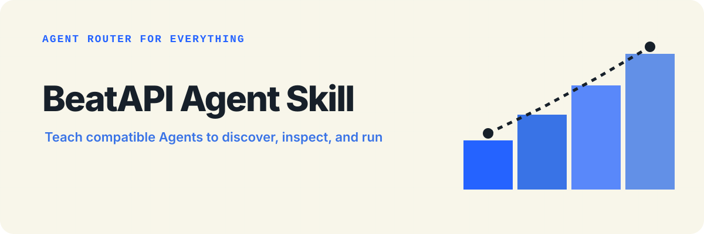

<p align="center">
  
</p>

<p align="center">
  <a href="https://beatapi.io/"><strong>Explore BeatAPI</strong></a> ·
  <a href="https://beatapi.io/dashboard/apikeys">Create an API key</a> ·
  <a href="https://beatapi.io/SKILL.md">Agent setup</a> ·
  <a href="#install">Install</a>
</p>

# BeatAPI Agent Skill

BeatAPI is the **Agent Router for Everything**: one route to Model, Data, Tool,
and Workspace capabilities. This repository teaches Agent Skills-compatible
hosts when and how to discover, inspect, and run the capabilities currently
available through BeatAPI.

Give a compatible Agent this one-line setup instruction:

```text
set up https://beatapi.io/SKILL.md
```

The public, agent-readable setup entrypoint is [`SKILL.md`](SKILL.md). It gives
the shortest path from a BeatAPI key to the unified Search → Inspect → Run loop.

The installable Skill is self-contained at:

```text
skills/beatapi-video/
```

It contains concise orchestration instructions, exact workflow references,
safe JSON templates, realistic evaluation prompts, UI metadata, and a reviewed
copy of the public BeatAPI OpenAPI contract.

## Where this repository fits

```text
Agent host -> BeatAPI Skill -> CLI or MCP -> BeatAPI -> Model · Data · Tool · Workspace
```

The Skill reflects the current public catalog and contract. Model and Social
Data capabilities are discoverable today; Tool and Workspace routes depend on
the interfaces and integrations available to the connected host.

## What users can ask

- “Make a music video from these images and this song.”
- “Let me choose and edit storyboard shots before composition.”
- “Create a vertical product ad from these photos.”
- “Check why my BeatAPI task failed.”
- “Upload these local inputs and wait for the hosted result.”
- “Configure BeatAPI success and failure webhooks.”
- “Search and run a Social Data action through BeatAPI.”
- “Create a 60-second Realtime Video session for my web app.”

The Skill prefers the Hosted MCP Search → Inspect → Run loop when the host
provides it. The complete Agent Plugin also bundles focused local MCP tools. A
standalone Skill installation falls back to the official `beatapi` CLI. None
of these adapters asks the user to paste an API key into a conversation.

## Requirements

- A BeatAPI customer account and API key
- An Agent Skills-compatible host
- One execution adapter:
  - BeatAPI Hosted MCP or local tools supplied by the complete Agent Plugin; or
  - Node.js 20.19+ / 22.12+ and `npm install --global beatapi`

Create a key at <https://beatapi.io/dashboard/apikeys>. For a standalone Skill
using the CLI fallback, authenticate in a terminal:

```bash
beatapi auth login
```

For MCP servers, CI, or ephemeral environments, set `BEATAPI_API_KEY` outside
the prompt.

## Install

Clone the repository and copy or symlink the Skill folder into the host's Skill
directory. For a Codex-compatible user installation:

```bash
mkdir -p ~/.agents/skills
ln -s /absolute/path/to/beatapi-skill/skills/beatapi-video \
  ~/.agents/skills/beatapi-video
```

Repository-scoped hosts can place the same folder under their documented local
Skills directory. Invoke it explicitly as `$beatapi-video` or let compatible
hosts trigger it from the description.

Cross-host plugin distribution is provided by the separate
`beatapi-agent-plugin` repository, which embeds this same Skill.

## Contract integrity

The installable folder bundles its own exact OpenAPI snapshot, so it remains
self-contained when submitted to Skill directories. Both copies are locked to
the reviewed public source:

```bash
npm run contract:sync
npm run verify
```

`npm run verify` checks contract equality, frontmatter, metadata, linked
resources, command guidance, templates, eval coverage, operation IDs, and
credential patterns.

## Repository structure

```text
skills/beatapi-video/
├── SKILL.md
├── agents/openai.yaml
├── assets/
├── evals/evals.json
└── references/
    ├── api-workflows.md
    ├── beatapi.openapi.yaml
    ├── credits-and-limits.md
    ├── errors-and-recovery.md
    ├── manual-music-video.md
    └── realtime-video.md
```

See [docs/submission-checklist.md](docs/submission-checklist.md) before
submitting the GitHub repository or Skill folder to a directory.

Build a ready-to-upload ZIP with:

```bash
npm run submission:build
```

The artifact is written to `dist/beatapi-video-skill.zip`.

## Security

Do not place API keys, webhook secrets, private media, or customer task data in
prompts, fixtures, screenshots, or public issues. See [SECURITY.md](SECURITY.md).

## License

MIT

<p align="center">
  Built by <a href="https://beatapi.io/"><strong>BeatAPI</strong></a> — Agent Router for Everything.
</p>
